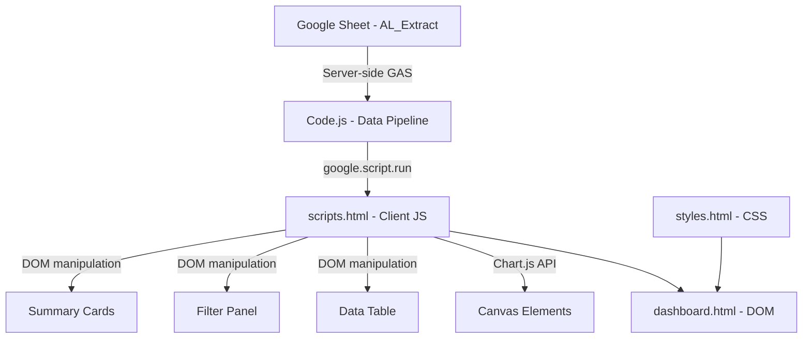

# Design Document: Contract Management Dashboard Redesign

## Overview

This design covers the Apple-inspired UI/UX overhaul of the Contract Management Dashboard — a Google Apps Script web app that reads ~9,159 contract rows from a Google Sheet and renders them client-side. The redesign touches three files: `styles.html` (complete CSS rewrite), `scripts.html` (chart rendering, filter wiring, debug log fix, table column fix, sorting), and `dashboard.html` (minor structural tweaks). The server-side data pipeline in `Code.js` remains untouched.

The core changes are:
1. Replace all CSS with an Apple-inspired grayscale design system
2. Implement Chart.js rendering for four chart types
3. Fix the debug log to be console-only
4. Wire up date range, financial range, and preset filters
5. Fix the duplicate CEILING column in the data table
6. Add column sorting to the data table

## Architecture

The application follows a simple client-server architecture within the Google Apps Script framework:



The architecture is entirely client-side rendering. The server sends raw JSON objects; all filtering, sorting, charting, and display logic lives in `scripts.html`. The CSS in `styles.html` is a standalone stylesheet with no dependencies beyond the system font stack.

### File Responsibilities

| File | Role | Changes |
|------|------|---------|
| `src/styles.html` | All CSS styles | Complete rewrite — grayscale palette, Apple typography, frosted glass effects |
| `src/scripts.html` | Client-side JS | Add chart rendering, fix debug log, wire filters, fix table columns, add sorting |
| `src/dashboard.html` | HTML structure | Minor tweaks — remove debug log visibility, adjust summary card icons |
| `src/Code.js` | Server-side data | No changes |

## Components and Interfaces

### 1. Style System (styles.html)

The CSS is organized into these logical sections:

- **CSS Custom Properties**: Define the grayscale palette and typography as CSS variables on `:root`
- **Reset & Base**: Box-sizing reset, body font/color/background
- **Header**: Dark gradient header (#000 → #1d1d1f), white text, nav buttons with grayscale hover states
- **Loading Overlay**: Grayscale spinner and progress bar
- **Filter Panel**: Consistent input styling, grayscale preset buttons, active filter tags in gray
- **Summary Cards**: Grayscale icon containers, subtle shadows, no colored gradients
- **Chart Section**: White card containers with subtle shadows
- **Data Table**: Grayscale header, alternating row shading, grayscale status badges
- **Pagination**: Grayscale page number buttons
- **Modals**: Grayscale overlay, card-style modal with subtle shadow
- **Responsive Breakpoints**: 768px and 480px breakpoints

CSS Variable Definitions:
```css
:root {
  --color-black: #000;
  --color-gray-900: #111;
  --color-gray-850: #1d1d1f;
  --color-gray-800: #333;
  --color-gray-700: #555;
  --color-gray-600: #666;
  --color-gray-500: #86868b;
  --color-gray-400: #999;
  --color-gray-350: #a1a1a6;
  --color-gray-300: #d2d2d7;
  --color-gray-200: #e8e8ed;
  --color-gray-100: #f5f5f7;
  --color-gray-50: #fafafa;
  --color-white: #fff;
  --font-family: -apple-system, BlinkMacSystemFont, "SF Pro Display", "SF Pro Text", "Helvetica Neue", sans-serif;
  --shadow-sm: 0 1px 2px rgba(0,0,0,0.08);
  --shadow-md: 0 4px 12px rgba(0,0,0,0.08);
  --shadow-lg: 0 8px 24px rgba(0,0,0,0.12);
  --radius-sm: 8px;
  --radius-md: 12px;
  --radius-lg: 16px;
  --transition: 0.2s ease;
}
```

### 2. Chart Manager (scripts.html)

A new `ChartManager` object encapsulates all Chart.js logic:

```
ChartManager
  - chartInstances: { status, organization, timeline, trends }
  - grayscaleColors: string[]
  - init(data): void — creates all four charts
  - updateAll(data): void — destroys and recreates charts with new data
  - createStatusChart(data): Chart — donut chart of AWARD_STATUS counts
  - createOrganizationChart(data): Chart — horizontal bar of CEILING by Client_Bureau (top 10)
  - createTimelineChart(data): Chart — bar chart of contract count by PROJECT_START year
  - createTrendsChart(data): Chart — line chart of total CEILING by PROJECT_START year
  - getGrayscaleColor(index): string — returns a color from the grayscale palette
  - destroy(): void — destroys all chart instances
```

Chart color palette (grayscale only):
```javascript
['#1d1d1f', '#333', '#555', '#666', '#86868b', '#999', '#a1a1a6', '#d2d2d7']
```

Each chart uses Chart.js v3+ API with these shared options:
- `responsive: true`
- `maintainAspectRatio: true`
- Font family set to the Apple typography stack
- Grayscale grid lines (#e8e8ed)
- Grayscale legend text (#666)
- No colored borders — use grayscale borders

### 3. Filter Controller (scripts.html)

Extends the existing `applyFilters()` function to wire up:

- **Date range filter**: Reads `dateFieldSelect` value (projectStart or projectEnd), compares `dateRangeStart`/`dateRangeEnd` against the corresponding contract field
- **Date presets**: Click handlers on `.date-preset-btn` that compute date ranges and set the inputs
- **Financial range filter**: Reads `financialMin`/`financialMax` and filters by CEILING value
- **Financial presets**: Click handlers on `.financial-preset-btn` that set min/max values
- **Active filter tags**: After filtering, renders tag elements in `#activeFiltersList` showing each active filter with a remove button

### 4. Table Sorter (scripts.html)

A new sorting mechanism:

```
TableSorter
  - currentSortColumn: string | null
  - currentSortDirection: 'asc' | 'desc'
  - sort(data, column): data[] — sorts the data array by the given column
  - comparator(a, b, column): number — type-aware comparison (string, number, date)
  - updateHeaderIndicators(): void — updates th classes for sort direction display
```

Clicking a `th[data-sort]` element triggers sorting. The sort operates on `filteredData` in-place, then re-renders the table.

### 5. Debug Log Fix (scripts.html)

The `debugLog` function is modified to only call `console.log()`. The DOM element reference and `el.style.display = 'block'` line are removed. The `#debugLog` div in `dashboard.html` is either removed or kept hidden with `display:none` permanently.

### 6. Table Column Fix (scripts.html)

In `renderTable()`, the Award Value column currently renders `formatMoney(parseFloat(c.CEILING) || 0)` — identical to the Ceiling column. This is changed to render "N/A" since no distinct award value field exists in the data pipeline.

## Data Models

The contract data object received from the server has this shape:

```typescript
interface ContractRow {
  AWARD_STATUS: string;      // e.g., "Active", "Completed"
  APEXNAME: string;
  EMP_ORG_SHORT_NAME: string;
  AWARD_TITLE: string;
  AWARD: string;             // Award number/ID
  PROJECT: string;           // Project number
  CONTRACT_TYPE: string;
  CEILING: number | string;  // Ceiling value (may be string from sheet)
  PM: string;                // Project manager
  CO: string;                // Contracting officer
  CS: string;                // Contract specialist
  PROJECT_TITLE: string;
  PROJECT_START: string;     // "yyyy-MM-dd" format
  PROJECT_END: string;       // "yyyy-MM-dd" format
  Client_Bureau: string;
  client_organization: string;
  FLAGS: string;
  Mod_Status: string;
}
```

Chart aggregation models:

```typescript
interface StatusCount {
  status: string;
  count: number;
}

interface OrgCeiling {
  organization: string;
  totalCeiling: number;
}

interface YearCount {
  year: number;
  count: number;
}

interface YearCeiling {
  year: number;
  totalCeiling: number;
}
```

Filter state model:

```typescript
interface FilterState {
  searchTerm: string;
  selectedStatuses: string[];
  selectedOrganizations: string[];
  selectedContractTypes: string[];
  dateField: 'projectStart' | 'projectEnd';
  dateStart: string | null;
  dateEnd: string | null;
  financialMin: number | null;
  financialMax: number | null;
}
```


## Correctness Properties

*A property is a characteristic or behavior that should hold true across all valid executions of a system — essentially, a formal statement about what the system should do. Properties serve as the bridge between human-readable specifications and machine-verifiable correctness guarantees.*

The following properties were derived from the acceptance criteria after prework analysis and redundancy reflection. Properties that were purely visual/CSS (hover states, responsive breakpoints, modal styling) or redundant (chart re-render on filter is implied by correct aggregation + correct filtering) were excluded.

### Property 1: Status chart aggregation correctness

*For any* array of contract objects with various AWARD_STATUS values, the status chart data produced by `createStatusChart` should contain one entry per unique AWARD_STATUS, and the count for each status should equal the number of contracts with that status in the input array.

**Validates: Requirements 3.1**

### Property 2: Organization chart aggregation correctness

*For any* array of contract objects with various Client_Bureau values and numeric CEILING values, the organization chart data produced by `createOrganizationChart` should correctly sum the CEILING values grouped by Client_Bureau, and each organization's total should equal the sum of CEILING for all contracts with that Client_Bureau.

**Validates: Requirements 3.2**

### Property 3: Timeline chart aggregation correctness

*For any* array of contract objects with valid PROJECT_START dates, the timeline chart data produced by `createTimelineChart` should contain one entry per unique year extracted from PROJECT_START, and the count for each year should equal the number of contracts starting in that year.

**Validates: Requirements 3.3**

### Property 4: Trends chart aggregation correctness

*For any* array of contract objects with valid PROJECT_START dates and numeric CEILING values, the trends chart data produced by `createTrendsChart` should contain one entry per unique year, and the total CEILING for each year should equal the sum of CEILING values for contracts starting in that year.

**Validates: Requirements 3.4**

### Property 5: Table column non-duplication

*For any* contract row rendered in the data table, the text content of the Award Value cell should not equal the text content of the Ceiling cell (i.e., the Award Value column should display "N/A" or a distinct value, never a duplicate of the CEILING value).

**Validates: Requirements 4.1, 4.2**

### Property 6: Multi-select filter correctness

*For any* array of contracts and any non-empty selection of status values, applying the status filter should produce a result where every contract's AWARD_STATUS is in the selected set, and no contracts with matching statuses are excluded. The same property holds for organization and contract type filters.

**Validates: Requirements 5.1**

### Property 7: Date range filter correctness

*For any* array of contracts with valid date fields and any date range [start, end], applying the date range filter should produce a result where every contract's selected date field falls within [start, end] inclusive.

**Validates: Requirements 5.2**

### Property 8: Financial range filter correctness

*For any* array of contracts with numeric CEILING values and any range [min, max], applying the financial range filter should produce a result where every contract's CEILING value is >= min and <= max.

**Validates: Requirements 5.4**

### Property 9: Clear all filter round-trip

*For any* array of contracts and any combination of applied filters, clearing all filters should produce a result set identical to the original unfiltered array.

**Validates: Requirements 5.7**

### Property 10: Summary cards reflect filtered totals

*For any* filtered dataset, the total contract value displayed should equal the sum of all CEILING values in the filtered set, the active count should equal the number of contracts with AWARD_STATUS "Active", and the completed count should equal the number with status "Completed" or "Closed".

**Validates: Requirements 6.3**

### Property 11: Table sorting correctness

*For any* array of contracts and any sortable column, sorting ascending should produce a sequence where each element is <= the next (by the column's comparator), and sorting descending should produce a sequence where each element is >= the next. Toggling sort on the same column should reverse the direction.

**Validates: Requirements 10.1, 10.2**

## Error Handling

### Chart Rendering Errors
- If Chart.js fails to render (e.g., canvas not found), catch the error and display a "Chart unavailable" message in the container instead of leaving a blank canvas.
- If the dataset for a chart is empty, display "No data available" centered in the chart container.
- Before creating a new chart, destroy any existing chart instance on the same canvas to prevent Chart.js memory leaks.

### Filter Errors
- If date inputs contain invalid dates, ignore the date filter and do not crash. Log a warning to console.
- If financial range inputs contain non-numeric values, ignore the financial filter.
- If a filter produces zero results, display the empty state in the table ("No contracts found") and update charts to show empty state.

### Data Loading Errors
- The existing error handling in `initializeDashboard`, `loadPage`, and `finishLoading` is preserved.
- If a page load fails mid-stream, continue with data loaded so far (existing behavior).

### Table Sorting Errors
- If a column value is null/undefined during sort, treat it as empty string for string columns, 0 for numeric columns, and epoch start for date columns.
- Sort should be stable for equal values.

## Testing Strategy

### Testing Framework

Since this is a Google Apps Script project with no npm/build tools, testing is done via standalone HTML test files that can be opened in a browser. The test files import the same functions and use a lightweight property-based testing approach.

For property-based testing, we use **fast-check** loaded via CDN (`https://cdn.jsdelivr.net/npm/fast-check/lib/bundle.js`). fast-check provides generators for arbitrary data and runs each property test for a minimum of 100 iterations.

### Unit Tests

Unit tests cover specific examples and edge cases:
- Debug log function writes to console only, does not modify DOM (Requirements 2.1, 2.2, 2.3)
- Date preset buttons compute correct date ranges (Requirements 5.3)
- Financial preset buttons set correct min/max values (Requirements 5.5)
- Empty dataset shows "No data available" in charts (Requirements 3.7)
- Award Value column shows "N/A" when no distinct field exists (Requirements 4.3)
- Sort direction indicator updates correctly on column header (Requirements 10.3)
- Loading overlay visibility toggles correctly (Requirements 7.1)
- Export modal opens with filter summary (Requirements 9.3)

### Property-Based Tests

Each correctness property is implemented as a single property-based test using fast-check:

- **Feature: contract-management-dashboard, Property 1: Status chart aggregation** — Generate random arrays of contracts with random AWARD_STATUS values, verify aggregation counts match.
- **Feature: contract-management-dashboard, Property 2: Organization chart aggregation** — Generate random contracts with random Client_Bureau and CEILING, verify sums match.
- **Feature: contract-management-dashboard, Property 3: Timeline chart aggregation** — Generate random contracts with random PROJECT_START years, verify counts match.
- **Feature: contract-management-dashboard, Property 4: Trends chart aggregation** — Generate random contracts with random years and CEILING, verify sums match.
- **Feature: contract-management-dashboard, Property 5: Table column non-duplication** — Generate random contract rows, verify Award Value cell text ≠ Ceiling cell text.
- **Feature: contract-management-dashboard, Property 6: Multi-select filter correctness** — Generate random contracts and random filter selections, verify filtered results match.
- **Feature: contract-management-dashboard, Property 7: Date range filter correctness** — Generate random contracts with dates and random date ranges, verify all results fall within range.
- **Feature: contract-management-dashboard, Property 8: Financial range filter correctness** — Generate random contracts with CEILING values and random [min, max], verify all results within range.
- **Feature: contract-management-dashboard, Property 9: Clear all filter round-trip** — Generate random contracts, apply random filters, clear all, verify result equals original.
- **Feature: contract-management-dashboard, Property 10: Summary cards reflect filtered totals** — Generate random filtered datasets, verify computed totals match.
- **Feature: contract-management-dashboard, Property 11: Table sorting correctness** — Generate random contract arrays and random column, verify sorted order.

Each test runs a minimum of 100 iterations. Each test is tagged with a comment: `// Feature: contract-management-dashboard, Property N: <title>`.
